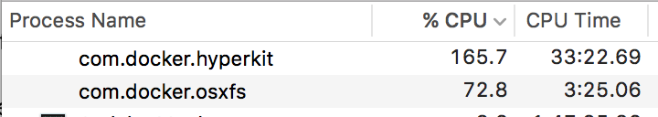

# Docker CPU spike

Repo for reproducing (one of the) CPU spiking issues on Docker for Mac

The following steps can be used to recreate the CPU spike issue when using
Docker for Mac.

####Clone the repo:

```
git clone https://github.com/jmreicha/cpu-bug.git
cd cpu-bug
```

####Build the `test` service:

`docker-compose build`

####Start the container:

`docker-compose up -d`

This will attempt to start the container using the locally mounted files and
should die right away since none of them are installed yet.  You can use
`docker-compose logs` to check.

####Install dependencies on the host system (OSX):

`yarn install` or `npm install`

####Watch the CPU spike:



Eventually (5ish minutes) the system levels off, otherwise you need to restart
the Docker for Mac app

##Notes

You can drop into a bash shell in the container to poke around using this command:

`docker-compose exec test bash`

From my testing, there seems to be less of a CPU hit if you install the packages and remove the `node_modules` directory from inside the container.

The `package.json` file contains random npm packages to replicate a repo with
many dependencies, they are not used outside of demonstrating the issue.  It
might take fewer dependencies to reproduce this, but the current package.json
file produces about 43k files after installation is finished.

The base image uses yarn to install the packages to speed up install times.  You
can install yarn on OSX with the `brew install yarn` command.

##Diagnostics

```
Docker for Mac: version: 1.12.5 (3e6f00c1d)
OS X: version 10.11.6 (build: 15G1004)
logs: /tmp/6CF4E326-BEB6-4F67-A37C-573FA4CBEFAE/20170103-123447.tar.gz
[OK]     vmnetd
[OK]     dns
[OK]     driver.amd64-linux
[OK]     virtualization VT-X
[OK]     app
[OK]     moby
[OK]     system
[OK]     moby-syslog
[OK]     db
[OK]     env
[OK]     virtualization kern.hv_support
[OK]     slirp
[OK]     osxfs
[OK]     moby-console
[OK]     logs
[OK]     docker-cli
[OK]     menubar
[OK]     disk
```
